# 十五个不同风格的表单页面

名称：十五个不同风格的表单页面

作者：KSaMar

日期：2023/7/5 - 2023/7/7

描述：十五个不同风格的表单页面，页面由易到难制作，每个表单都配置有 注册页面、重置密码页面、简单判断功能

素材均来源于网络，切勿用于商业行为，仅供学习与参考，个人行为后果自负。

喜欢就点个 Star 吧！

## 开发环境

网页制作工具：VSCode

JavaScript框架：JQuery

## 简介

十五个不同风格的表单页面

一、凹凸风格表单页面 - Bump style form page✅

二、模糊背景风格表单页面 - Fuzzy background style form page✅

三、嵌入式风格表单页面 - Embedded style form page✅

四、苹果风格表单页面 - Apple style form page✅

五、简约风格表单页面 - Simple style form page✅

六、极简风格表单页面-1 - Minimalist style form page-1✅

七、极简风格表单页面-2 - Minimalist style form page-2✅

八、渐变风格表单页面 - Gradient style form page✅

九、弹出风格表单页面 - Pop-up style form page✅

十、左右风格表单页面 - Left and right style form pages✅

十一、左右滑动风格表单页面-1 - Left and right sliding style form page-1✅

十二、左右滑动风格表单页面-2 - Left and right sliding style form page-2✅

十三、选项卡风格表单页面 - Tab style form page✅

十四、左右选项卡风格表单页面 - Left and right option tab style form page✅

十五、二次元风格表单页面 - ACGN style form page✅

## 统一命名

| 输入框名称     | class           | id              |
| -------------- | --------------- | --------------- |
| 账号输入框     | username        | username        |
| 密码输入框     | password        | password        |
| 手机输入框     | phone           | phone           |
| 验证码输入框   | code            | code            |
| 验证码获取按钮 | code-button     | code-button     |
| 登录按钮       | login-button    | login-button    |
| 注册按钮       | register-button | register-button |
| 修改密码按钮   | reset-button    | reset-button    |

## 项目图片

### 一、凹凸风格表单页面

### 二、模糊背景风格表单页面

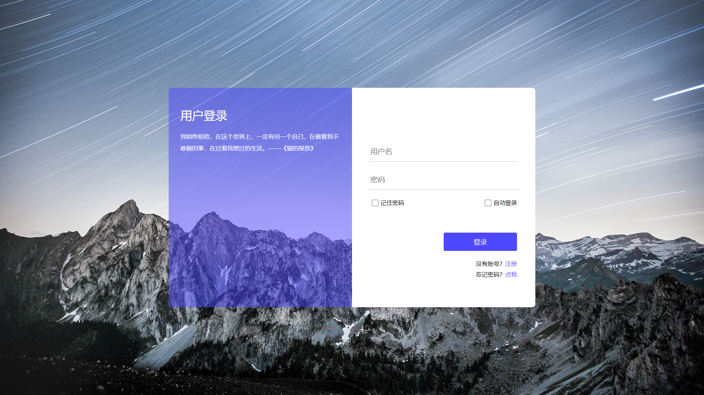

### 三、嵌入式风格表单页面

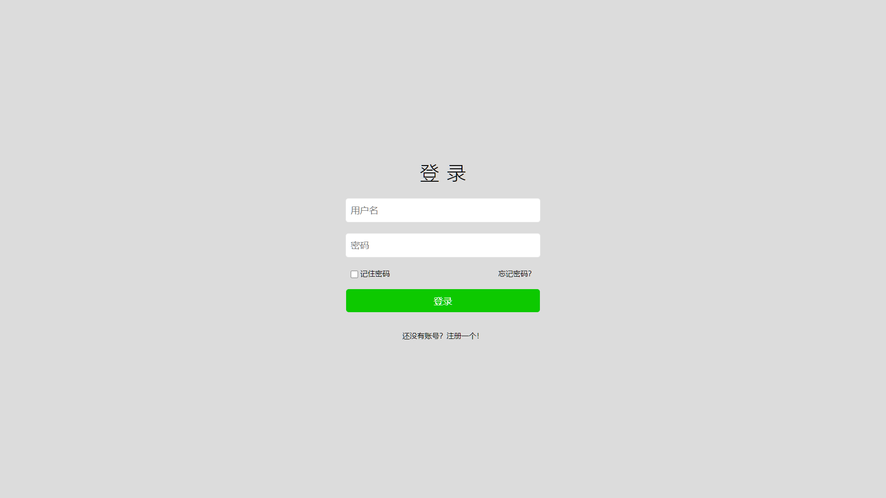

### 四、苹果风格表单页面

### 五、简约风格表单页面

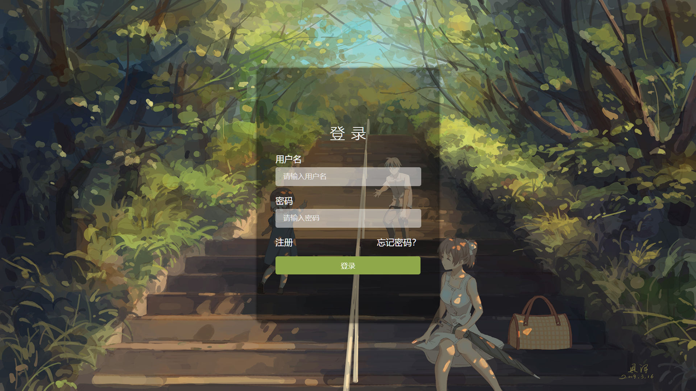

### 六、极简风格表单页面

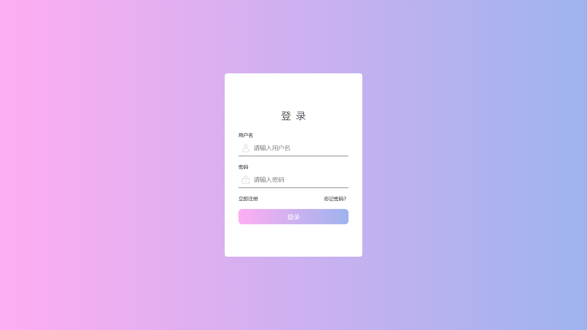

### 七、极简风格表单页面

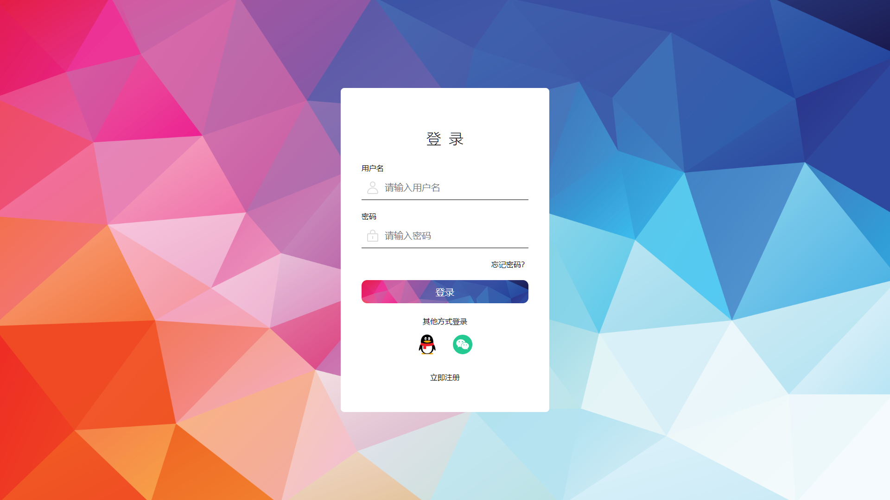

### 八、渐变风格表单页面

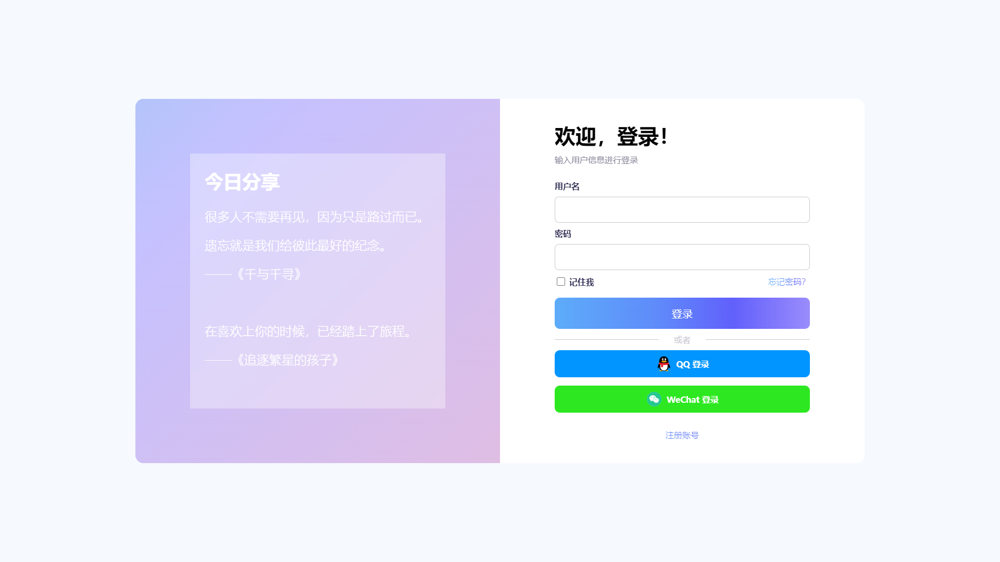

### 九、弹出风格表单页面

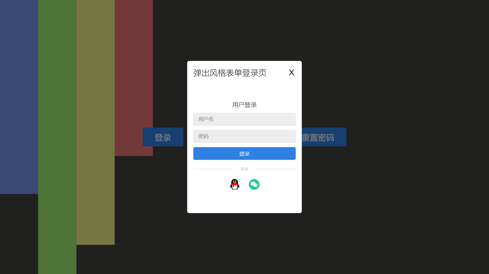

### 十、左右风格表单页面

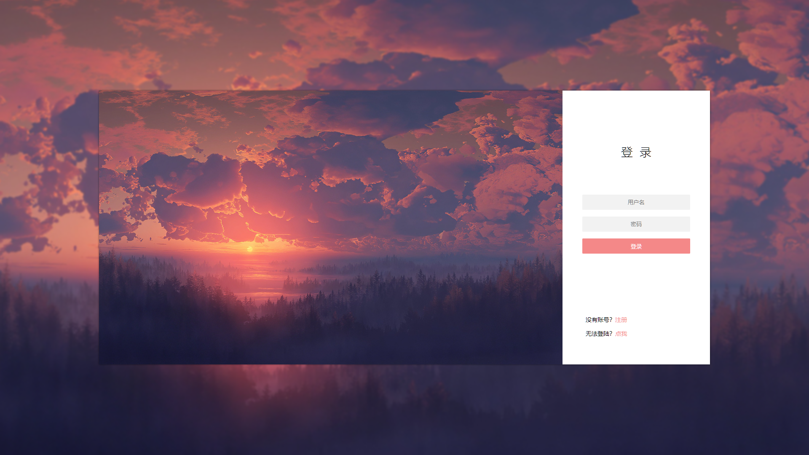

### 十一、左右滑动风格表单页面-1

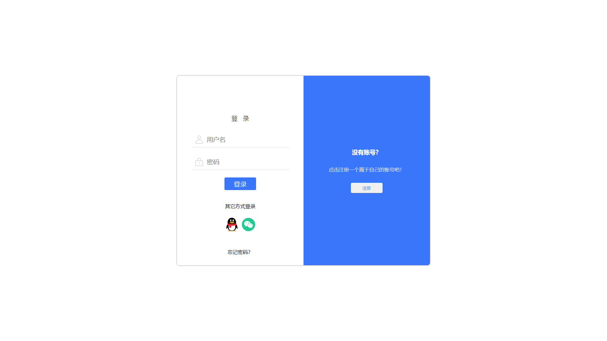

### 十二、左右滑动风格表单页面-2

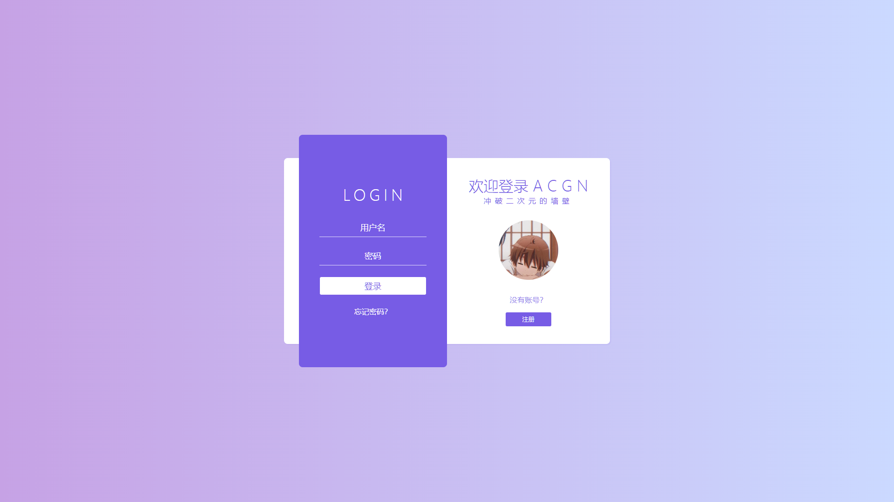

在不同的屏幕下，显示的紫色会有所区别

### 十三、选项卡风格表单页面

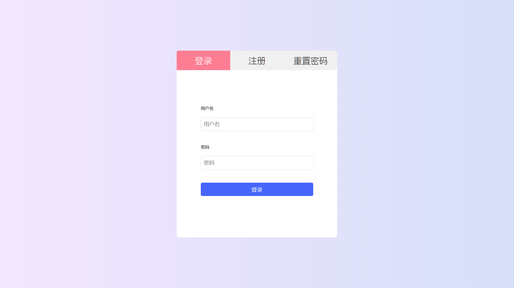

### 十四、左右选项卡风格表单页面

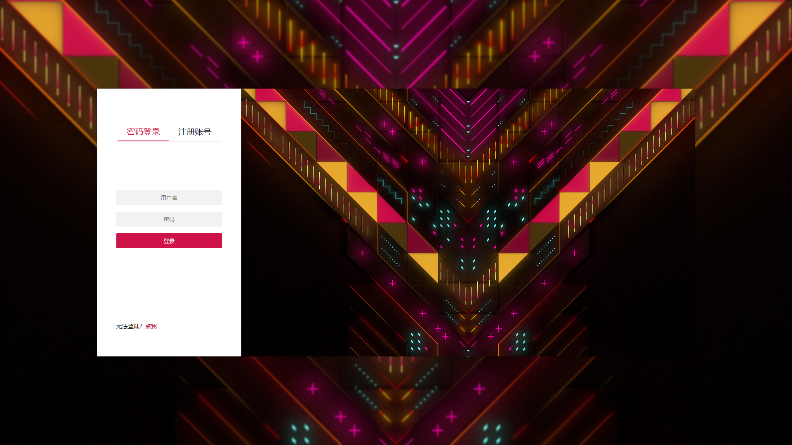

### 十五、二次元风格表单页面

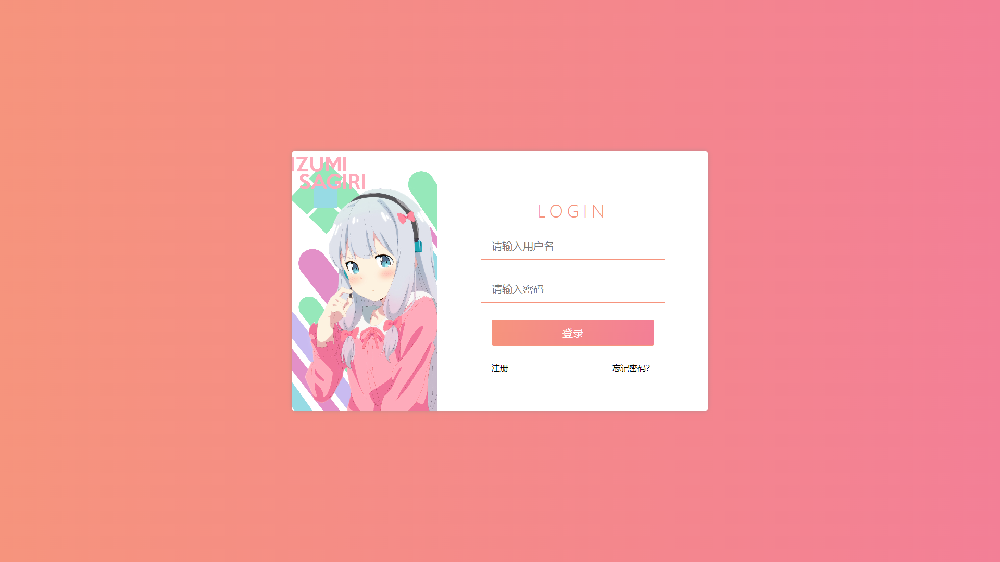

## Bilibili

欢迎在 B 站上关注我

[哔哩哔哩](https://space.bilibili.com/51110915) KSaMar

